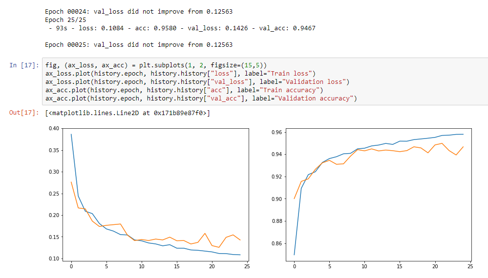
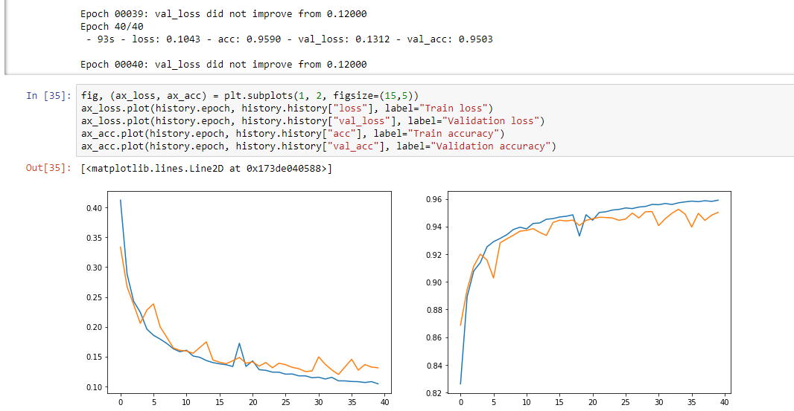

# TIMELINE
##  2018/07/29
#### first submission, 0.71, No.300
with model v2, 50 epochs
#### possible update:
 - more epochs, as the validation loss is still reducing             
 - take dropout to evide overfitting                                 
 - use new mean_iou                                                  
 - use one more channel of the np.cumsum() as input                  
 - changing the learning rate as training
 - test for the original Unet, to see if my model is good or not

## 2018/07/30
#### new change:
 - use mean_iou as monitor
 - change batch size to 64 -> 32 (resource not enough)
##### result 0.586  bad result
 - because of ouverfitting???	
	as for this problem, we only has two classes, and without complete situations, I think
	there won't be any problem of overfitting(in another word we want overfitting).

 - or I should not change the batch size??
	It is beacuse of the batch size. Model with larger batch size uses more resource in GPU,
	 which can acclerate the training process. But as the batch is large, the result tends 
	to converge in the local optimal result(training more likely to GD other than SGD).

 - the mean iou as monitor??
	From the result, the monitor value is getting better
	however the val_loss varies a lot from 0.7 to 0.1 between some epochs
	mayby is better to use default monitor

#### next training:
 - continue with the training in 7/29 for another 20 epochs
 - and test batch size 8 
 - ** deeplab choose: epoch = iteration * batch_size / num_image (make sense)

#### further thinking:
  I can change the learning rate, when it come to some local maximum -> take a larger learning rate 

## 2018/09/03 test
the kernels in kaggle all stopped at 6 hours, with the result notebook only with code(strange),
no error offered.
As I inferred the offical site of kaggle, I knew that kaggle has limitted the ues of kernel service
(from 1 hours running to 6 hours running).
So I suppose I need to use my only computer to training.

#### Test1 50 epoch
results in 0.6xx score(compare to the former result 0.74 with about 10 epoch or more when running in 
kaggle kernel, with the same model and hype parameters). I think the problem belongs to overfitting.
(even though the output loss evluation seems good).

## 2018/09/04
#### Test1  25 epoch
result in 0.71 much better than the test yesterday, but still worse than my best.
(maybe still overfitting ?)

#### Test2  40 epoch with dropout
result in 0.71 same as before need to know whether it is overfitting or not.

## 2019/09/06
#### Test1  30 epoch with dropout
0.71 on changes
